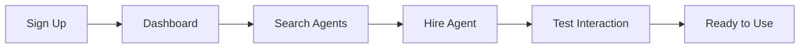

## Prerequisites

<Callout kind="info" title="What you'll need">
- A modern web browser like Chrome, Firefox, or Safari
- An active internet connection
- An email address for account verification

No credit card or prior setup required to get started.
</Callout>

## Create Your Account

Follow these steps to sign up and access the Agent.ai dashboard.

<Steps>
  <Step title="Visit Agent.ai" icon="globe">
    Open your browser and navigate to [agent.ai](https://agent.ai).

    Click the **Sign up for free** button prominently displayed on the homepage.
  </Step>

  <Step title="Complete Registration" icon="user-plus">
    Fill out the form with your email address, create a strong password, and provide any required details.

    Accept the terms of service and privacy policy.
  </Step>

  <Step title="Verify Your Email" icon="mail">
    Check your inbox for a verification email from Agent.ai.

    Click the verification link to activate your account and proceed to the dashboard.
  </Step>
</Steps>

<Callout kind="tip">
  If you don't receive the verification email, check your spam folder or request a new one from the login page.
</Callout>

## Explore the Dashboard

Once logged in, you'll land on the main dashboard featuring search, filters, and highlighted agents.

<Tabs>
  <Tab title="Search Interface" icon="search">
    Use the search bar at the top to find agents by name, category, or keyword (e.g., "meeting prep").

    Apply filters by tags like Premium, Productivity, or Sales to narrow results from over 2,000 agents.
  </Tab>

  <Tab title="Featured Agents" icon="star">
    Scroll to the **Featured Agents** section to browse top-rated options like Meeting Prep and Meeting Follow-up.

    Each card shows a preview image, description, and **Hire This Agent** button.
  </Tab>
</Tabs>

## Hire and Test Your First Agent

<Steps>
  <Step title="Select an Agent" icon="zap">
    Click on a featured agent, such as [Meeting Prep](https://agent.ai/profile/pdpzcsiz2xjfcvgn), to view its details.

    Review the description, screenshots, and capabilities.
  </Step>

  <Step title="Hire the Agent" icon="shopping-cart">
    Click **Hire This Agent** and follow the prompts to add it to your workspace.

    Premium agents may require a subscription—start with free trials where available.
  </Step>

  <Step title="Interact and Test" icon="play-circle">
    Open the agent interface and send a test prompt, like "Prepare a brief for my sales call with Acme Corp next Tuesday."

    Review the generated output, such as custom meeting briefs or summaries.
  </Step>
</Steps>

## Next Steps

<Columns cols={3}>
  <Card title="Introduction" icon="book-open" href="/introduction">
    Learn more about the Agent.ai platform and key concepts.
  </Card>

  <Card title="Authentication" icon="lock" href="/authentication">
    Set up secure API access for advanced agent integrations.
  </Card>

  <Card title="Help Center" icon="help-circle" href="/help-center">
    Find FAQs, troubleshooting, and support resources.
  </Card>
</Columns>

<Callout kind="success">
  Congratulations! You've hired your first AI agent. Explore more features or check the [changelog](/changelog) for updates.
</Callout>